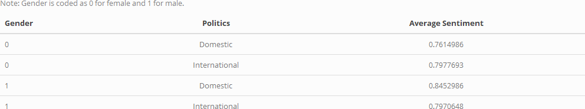

# How is Weibo Feeling? - _A Sentiment Analysis of Weibo Corpus_
A sentiment and textual analysis of the [Leiden Weibo Corpus Database](http://lwc.daanvanesch.nl/index.php) which consists of 5,103,566 messages posted on Sina Weibo in January 2012.

## Introduction
This project analyzes Leiden Weibo Corpus (a Chinese microblogging dataset) to reveal, how Chinese netizens feel about particular domestic and international political developments. Because it is known that China’s netizens are subjected to censorship of viewing or posting content considered inappropriate or anti-government, examining social media sentiment in China is particularly unique. The issues I examine further from Weibo sentiment include the London Olympics, the Diaoyu Island dispute, and government approval, all hotly contested topics in the government and in the media. From this project, others can understand the varying regional sentiments on these instrumental domestic and international developments across the country of China. Additionally, some questions I address include: Is public sentiment generally positive or negative when referencing domestic politics vs international politics? Is sentiment regarding topics directly correlated across regions of China and/or by sex regarding popular political developments?

## Technology/Framework
Data was cleaned and wrangled with:
* Jupyter Notebook (Python v. 3.6)
* Main Libraries:
  + [SnowNLP](https://github.com/isnowfy/snownlp)
  + pandas
  + numpy
  + matplotlib
  + seaborn
  + csv  

Visualizations created with:
* RStudio
* Main Libraries:
  + tidyverse

Usage of SnowNLP, a Python library inspired by Textblob applied to Chinese text, builds off of the following sources:  
(1) [Beginner’s Guide to Sentiment Analysis for Simplified Chinese using SnowNLP](https://towardsdatascience.com/beginners-guide-to-sentiment-analysis-for-simplified-chinese-using-snownlp-ce88a8407efb)  
(2) [Python & SnowNLP: Sentiment Analysis for the Chinese Language](https://medium.com/analytics-vidhya/python-snownlp-sentiment-analysis-for-the-chinese-language-8d9cafd0447d)  

I created a framework where provided the entire Leiden Weibo Corpus, keywords can be inputted such that subsets of the Leiden Weibo Corpus could be created for more focused analysis. This framework only performs successfully after extensive cleaning is run beforehand such as changing data types, accounting for the encoding of Chinese characters, errors in data parsing, removing extraneous characters, etc. Additional data cleaning is run only on the subsetted data to optimize efficiency. This includes recoding geographic data and calculating sentiment. The subsetted data sets are then written as CSV files for further visualization and analysis utilizing R/RStudio. 

## Example Results
I have included one such visualization below comparing average sentiment of male and female users regarding five topics: the Olympics, Diaoyu/Senkaku Islands, gender types, perspectives on success, and government approval. Sentiment as calculated using the SnowNLP library ranges from 0 to 1 (negative to positive). Panels represent a particular province or territory in China each of which has five stacked barplots for each of the five topics considered. 

  

Below is a table created from the five topics in consideration above. The topics are recoded as regarding domestic or international politics and average sentiment is calculated within those groupings.  

  
